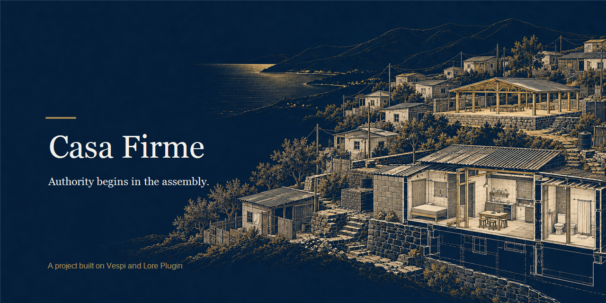

<p align="center">
  <a href="./assets/cover.png"></a>
</p>

<h1 align="center">Casa Firme</h1>

<p align="center">
  <a href="#english"></a>
  <a href="./LICENSE"></a>
  <a href="./docs/EVIDENCE.md"></a>
  <a href="./docs/HOW_IT_WORKS.md"></a>
  <a href="https://github.com/andresanemic/vespi"></a>
  <a href="https://github.com/andresanemic/vespi/tree/ed559e83c976dd6e6a379a5510db776206f670b4"></a>
</p>

<p align="center"><b>Casa Firme</b> — a family applying for housing should not have to hand over its identity to prove what happened.<br>
Limited permissions, a separate check, and limits on how the family's data is used. Evidence: 24/24 tests. Fictional families and data.</p>

<p align="center"><b>A housing application should not have to surrender a family's identity to prove what happened.</b></p>


<p align="center"><b>We’re applying to the Find Your Way hackathon and plan to participate in Meridian.</b></p>
<p align="center"><b>For judges:</b> <a href="./docs/HOW_IT_WORKS.md">How it works</a> · <a href="./docs/EVIDENCE.md">Evidence</a> · <a href="./docs/LEGAL_AND_LIMITS.md">Limits</a> · <a href="./CODE_NOT_INCLUDED.md">Source and review terms</a>.<br>This public snapshot contains documentation and evidence, not runnable source.</p>

---

<details>
<summary><b>Read in English</b></summary>

<a id="english"></a>

**Authority should be visible before a home is built.**

## The unit

**The unit is the housing application and the donation's path to its recorded use.**

Casa Firme follows one fictional housing application from the committee assembly to construction, donation use and the donor's receipt trail. Authority begins in the housing committee's assembly minutes. Volunteers, a foundation and the municipality receive separate, bounded permissions. The donor can follow the recorded contribution without seeing the family.

## Why this exists

In an informal settlement, a home can depend on people who do not answer to one another: the community, its housing committee, volunteers, a foundation, a municipality, the State and donors. The family may be asked to prove eligibility; the committee may be expected to speak for the community; work may begin under an unclear mandate; and a contribution can disappear into a sequence no donor can follow. The same journey can expose the people it is meant to help.

Casa Firme turns those tensions into a local example with explicit boundaries. The assembly's recorded decision is the source of authority. Every permission states what it covers, how much it allows, where it applies and when it expires. The family is represented by an alias and a fingerprint in a closed record schema. Each step adds a receipt so the recorded use can be followed back to the contribution.

## In one minute

A family applies under an alias. The first assembly does not have quorum, so no permission is granted. A later assembly records two named approvals and grants separate scopes to volunteers, a foundation and the municipality. The volunteers and foundation record construction. A donor contributes ten fictional material units; three are recorded as used for housing materials. The same use is submitted again, but the record still contains one use and the same receipt. The donor can follow the application, assembly, construction and use receipts without seeing the family's alias. A third party can rebuild the journey from receipts alone.

Every actor and datum in this account is fictional. This is a local walkthrough, not an account of a real settlement, institution, donation or build.

## What it looks like in practice

The supplied terminal journey puts the rule under pressure before it shows the successful path. The following lines are excerpts from that run; the examples use fictional actors and synthetic data.

First, one approval is missing from a two-approval assembly. The application waits, and the permission count stays at zero:

```text
estado: necesita_decision · missing 1 approval (1 of 2)
salida: vuelve al comité de vivienda: convoca una asamblea nueva con quorum
permisos en el registro ahora: 0. Sin quorum no hay ni uno.
```

With quorum, the recorded assembly grants distinct permissions. A later attempt to expand the volunteer budget from four units to nine is rejected:

```text
estado: verificado · recibo verified · decidido por: miembro-a, miembro-b
permiso-voluntarios  voluntario-1  construccion  «montar la vivienda»  4 unidades
rechazado: una derivación que agranda el presupuesto amplifica el permiso: 4 → 9
```

The fictional donor contributes ten units and the record accepts a use of three. Repeating the same use returns the same receipt instead of creating a second use:

```text
estado: verificado · recibo verified · sello 2f8ef9a0feac1771…
el mismo uso otra vez: repetido — mismo sello 2f8ef9a0feac1771…, y el registro tiene 1 uso.
```

The donor's view follows the recorded steps. In the run, each of these receipts is reported as verified and its seal as intact:

```text
postulacion   la familia del catastro sello 1a32ca9585726080…  estado verified  sello íntegro: true
acta          comite-1               sello d31f990281d30229…  estado verified  sello íntegro: true
construccion  voluntario-1           sello 96f6172a8b8fcc68…  estado verified  sello íntegro: true
uso           donante-1              sello 2f8ef9a0feac1771…  estado verified  sello íntegro: true
```

The transcript also says that the alias does not appear in the donor's journey, and that a third party can verify the receipts and resume the journey without Casa Firme. These are outputs from the supplied local run, not output generated by this public documentation repository. Its receipt anchor remains `pending`, the zero-knowledge proof is labelled simulated, and the run says no data went to a network.

## How it works

```text
  family applies with alias
            |
            v
  committee assembly minutes + quorum
            |
            +---- scoped grant ----> volunteers ----> construction receipt
            +---- scoped grant ----> foundation -----> construction receipt
            +---- scoped grant ----> municipality ---> delivery receipt
            |
            v
  donor contribution ----> recorded use ----> local receipt chain
                                                   |
                                  donor reads trail; verifier recomputes
```

The assembly decision is the authority boundary. A member cannot grant alone or enlarge the assembly's permission. Each grant is bounded by action, material-unit budget, destination and expiry; delegation can narrow those limits but cannot extend them. A step outside its grant returns blocked with a reason and an exit. The local JSONL record links each line to the previous fingerprint. A verifier recomputes from the record rather than trusting the executor's summary.

| Actor | Right in this model | Boundary |
|---|---|---|
| Applicant family | Apply; appear as an alias and fingerprint | Cannot grant permissions or sign for the assembly; the schema has no direct identity field |
| Housing committee assembly | Evaluate the application and grant scoped permissions through its minutes | Below its declared quorum, it grants nothing |
| Committee members | Sign as named assembly members | No member grants alone or exceeds the minutes |
| Volunteers | Record construction under their permission | Bound by scope, material units, destination and expiry |
| Foundation | Contribute material and execute its own authorized work | Its size gives it no authority beyond its grant |
| Municipality | Record its authorized delivery step | Acts only within its own grant |
| Donor | Contribute and read the receipt trail | Sees the recorded trail, not the family |
| Verifier | Recompute what the supplied record supports | Checks that record; does not establish real-world truth |

## Why Casa Firme

| You need | What it gives you | Where it lives |
|---|---|---|
| Know who had authority to approve a step | Assembly minutes, named quorum and separate grants for construction and delivery | [How it works: authority and actors](./docs/HOW_IT_WORKS.md#actors-rights-and-limits) |
| Stop a delegated permission from growing | A grant for four units cannot be widened to nine; the attempted expansion returns blocked | [How it works: permission rules](./docs/HOW_IT_WORKS.md#permission-rules) |
| Trace a contribution to a recorded use | A ten-unit fictional contribution, a three-unit use and a receipt trail the donor can read | [Evidence: the supplied journey](./docs/EVIDENCE.md#the-supplied-journey) |
| Keep a family out of the donor's view | A closed family schema, an alias and a fingerprint; the run checks what would be published | [Legal and limits](./docs/LEGAL_AND_LIMITS.md#family-data-and-privacy) |

## What Casa Firme is not

It is not a housing registry, an eligibility decision, a donation manager, a deployed service or a real institution's process. It is a local, fictional vertical journey that makes authority, permission bounds and receipt continuity inspectable. The public repository contains the documentation for review; its application source is not included here.

## Evidence you can open

The supplied test record of 2026-10-09 reports **24 tests, 24 passing, none otherwise, none skipped, on Node v24.15.0**. It covers assembly quorum and signatures, delegated limits, budgets, expiry, destination, duplicate donations, construction authorization, closed family fields, receipt sealing and chain tampering, independent recomputation, the donation journey, the command-line contract, and the vendored kernel copy (presence, digests, provenance headers, load from vendor). The adversarial RED phase was written before code, but that early run stopped at import because the application module did not yet exist; it records the intended attacks, not an executed result for each one.

The 2026-10-03 capture was red under the old 0.1.3 kernel cut; the project has since been re-pinned to 0.1.5 and the 2026-10-09 capture is green. See [Evidence](./docs/EVIDENCE.md) for the exact scope and the reference capture.

## Casa Firme, Vespi and Lore Plugin

Casa Firme consumes the Vespi kernel for bounded authority, named human approvals, operation receipts, verification and continuity from receipts. Its own layer supplies the housing-committee assembly as the authority source, quorum and member rules, the fictional donation path, the local chained record and the closed family-field schema. The kernel is pinned and checked by digest; Casa Firme does not modify it. The project uses kernel **0.1.5** (commit `ed559e8`), vendored and digest-checked in the 2026-10-09 run.

**What this relationship means.** The project was built with Lore Plugin's method (its agreement and criterion live in the project, in `acuerdo.md` and `lore/`), and its operations, authority and receipts run on the Vespi kernel 0.1.5, in the pinned copy that Lore Plugin 2.5.1 distributes (`skills/vespi/core/kernel`). That copy sits in the project as `vendor/vespi-kernel` and the suite verifies it against its `SOURCE.md`. Lore Plugin does not run inside the project. This project does not use the kernel's newer capabilities (Stellar pubnet anchors, live x402 settlement, the ZK verifier, emergency access); it exercises the core of operations, authority and receipts.

Lore Plugin provides the project context and routing through which a host can load the right criteria. It does not provide the housing model. Details about which capabilities this project uses, and which are only declared or absent, are in [How it works](./docs/HOW_IT_WORKS.md#what-the-kernel-contributes).

## What it does not do, and what is not verified

There is no network call, real payment, custody, blockchain transaction, Stellar testnet anchor or participating third party. The receipt anchor stays `pending`. The zero-knowledge proof is simulated. The record does not establish that a real family belongs to a registry or has a legal right to housing. No legal professional reviewed the project, and no legal standard is claimed as a design basis. The project has not established deployed privacy, institutional adoption, real construction or production readiness. The law mentioned in project planning was not checked against its primary text and is therefore not identified here.

## How to review this project

Read [How it works](./docs/HOW_IT_WORKS.md) for the model, actors and example; [Evidence](./docs/EVIDENCE.md) for current results and what they prove; [Legal and limits](./docs/LEGAL_AND_LIMITS.md) for the unverified legal context and data boundaries; and [Code not included](./CODE_NOT_INCLUDED.md) for the source-release conditions. The [review-only license](./LICENSE) governs evaluation rights. The public record is documentation, not a runnable copy of the application.

The public project documents do not confirm whether the application source will be available during the judges' review period or give an availability date. See [Code not included](./CODE_NOT_INCLUDED.md) for the current publication conditions.

## Author

**Andrés Peña Mellado**, Digital Art Director & Creative Developer working across AI agents, Web3, design and research. Repository authority: `andresanemic`.

[](https://t.me/andresanemic) &nbsp;&nbsp; [<picture><source media="(prefers-color-scheme: dark)" srcset="./assets/icons/v2/x-dark.svg"></picture>](https://x.com/andresanemic) &nbsp;&nbsp; [](https://www.linkedin.com/in/andresanemic/)

---

[How it works](./docs/HOW_IT_WORKS.md) · [Evidence](./docs/EVIDENCE.md) · [Legal and limits](./docs/LEGAL_AND_LIMITS.md) · [Code not included](./CODE_NOT_INCLUDED.md) · [Review-only license](./LICENSE) · [Vespi](https://github.com/andresanemic/vespi) · [Lore Plugin](https://github.com/andresanemic/lore-plugin)

</details>

<details>
<summary><b>Leer en español</b></summary>

<p align="center"><b>Postulamos a la hackatón Find Your Way y planeamos participar en Meridian.</b></p>

<a id="espanol"></a>

<p align="center"><b>Casa Firme</b> — una familia que postula a una vivienda no debería entregar su identidad para probar qué pasó.<br>
Permisos limitados, una comprobación aparte y límites al uso de los datos de la familia. Evidencia: 24/24 pruebas. Familias y datos ficticios.<br>Un recorrido de vivienda donde la autoridad empieza en la asamblea y cada paso deja recibo.</p>

**Antes de construir una vivienda, la autoridad debe poder verse.**

## La unidad

**La unidad es la postulación de vivienda y el trayecto de la donación hasta su uso registrado.**

Casa Firme sigue una postulación ficticia desde el acta de la asamblea del comité hasta la construcción, el uso de una donación y el recorrido de recibos que puede leer el donante. La autoridad nace en el acta de la asamblea del comité de vivienda. Voluntarios, una fundación y la municipalidad reciben permisos distintos y acotados. El donante puede seguir el aporte registrado sin ver a la familia.

## Por qué existe

En un asentamiento informal, una vivienda puede depender de personas que no responden unas ante otras: la comunidad, su comité de vivienda, voluntarios, una fundación, una municipalidad, el Estado y donantes. A la familia pueden pedirle que demuestre su elegibilidad; se puede esperar que el comité hable por la comunidad; el trabajo puede empezar sin un mandato claro; y un aporte puede perderse en una secuencia que el donante no puede seguir. Ese mismo recorrido puede exponer a las personas a las que busca ayudar.

Casa Firme convierte esas tensiones en un ejemplo local con límites explícitos. La decisión registrada por la asamblea es el origen de la autoridad. Cada permiso declara qué abarca, cuánto permite, dónde se aplica y cuándo vence. La familia se representa mediante un alias y una huella dentro de un esquema cerrado. Cada paso agrega un recibo para que el uso registrado pueda seguirse hasta el aporte.

## Si estás evaluando Find Your Way o Meridian, empieza aquí

Lee la base del proyecto y su recorrido. Empieza por [Cómo funciona](./docs/HOW_IT_WORKS.md).

Abre el registro de pruebas. Consulta [Evidencia](./docs/EVIDENCE.md).

Lee los límites jurídicos y de verificación. Consulta [Marco legal y límites](./docs/LEGAL_AND_LIMITS.md).

Revisa las condiciones de publicación. Consulta [Código no incluido](./CODE_NOT_INCLUDED.md) y la [licencia de solo revisión](./LICENSE).

## En un minuto

Una familia postula con un alias. La primera asamblea no alcanza el quorum y no otorga permisos. Una asamblea posterior registra dos aprobaciones con nombre y otorga alcances separados a voluntarios, una fundación y la municipalidad. Voluntarios y fundación registran la construcción. Un donante aporta diez unidades ficticias de material; se registran tres como usadas para materiales de vivienda. El mismo uso se envía de nuevo, pero el registro conserva un solo uso y el mismo recibo. El donante puede seguir los recibos de postulación, asamblea, construcción y uso sin ver el alias de la familia. Una tercera parte puede reponer el recorrido usando solo los recibos.

Todos los actores y datos de este relato son ficticios. Es un recorrido local, no una historia de un asentamiento, una institución, una donación o una construcción reales.

## Cómo se ve en la práctica

El recorrido suministrado por terminal pone a prueba la regla antes de mostrar el camino que sí avanza. Estas líneas son fragmentos de esa corrida; los actores son ficticios y los datos, sintéticos.

Primero, falta una aprobación para una asamblea que requiere dos. La postulación queda en espera y el recuento de permisos sigue en cero:

```text
estado: necesita_decision · missing 1 approval (1 of 2)
salida: vuelve al comité de vivienda: convoca una asamblea nueva con quorum
permisos en el registro ahora: 0. Sin quorum no hay ni uno.
```

Con quorum, el acta registrada otorga permisos distintos. Después se rechaza el intento de ampliar de cuatro unidades a nueve el presupuesto de los voluntarios:

```text
estado: verificado · recibo verified · decidido por: miembro-a, miembro-b
permiso-voluntarios  voluntario-1  construccion  «montar la vivienda»  4 unidades
rechazado: una derivación que agranda el presupuesto amplifica el permiso: 4 → 9
```

El donante ficticio aporta diez unidades y el registro acepta un uso de tres. Al repetir el mismo uso, se devuelve el mismo recibo en vez de crear otro uso:

```text
estado: verificado · recibo verified · sello 2f8ef9a0feac1771…
el mismo uso otra vez: repetido — mismo sello 2f8ef9a0feac1771…, y el registro tiene 1 uso.
```

La vista del donante sigue los pasos registrados. En la corrida, cada uno de estos recibos aparece como verificado y con el sello íntegro:

```text
postulacion   la familia del catastro sello 1a32ca9585726080…  estado verified  sello íntegro: true
acta          comite-1               sello d31f990281d30229…  estado verified  sello íntegro: true
construccion  voluntario-1           sello 96f6172a8b8fcc68…  estado verified  sello íntegro: true
uso           donante-1              sello 2f8ef9a0feac1771…  estado verified  sello íntegro: true
```

La transcripción también dice que el alias no aparece en el recorrido del donante y que una tercera parte puede verificar los recibos y reponer el recorrido sin Casa Firme. Son salidas de la corrida local suministrada, no de una ejecución de esta documentación pública. El anclaje del recibo queda en `pending`, la prueba de conocimiento cero se etiqueta como simulada y la corrida indica que ningún dato llegó a una red.

## Cómo funciona

```text
  la familia postula con un alias
               |
               v
  acta de asamblea del comité + quorum
               |
               +---- permiso acotado ----> voluntarios ----> recibo de construcción
               +---- permiso acotado ----> fundación ------> recibo de construcción
               +---- permiso acotado ----> municipalidad --> recibo de entrega
               |
               v
  aporte del donante ----> uso registrado ----> cadena local de recibos
                                                        |
                                  donante lee el rastro; verificador recalcula
```

La decisión de la asamblea marca el límite de autoridad. Un miembro no puede otorgar por sí solo ni ampliar el permiso de la asamblea. Cada permiso acota la acción, el presupuesto en unidades de material, el destino y el vencimiento; delegar puede reducir esos límites, pero no extenderlos. Un paso fuera del permiso vuelve bloqueado, con una razón y una salida. El registro JSONL local enlaza cada línea con la huella anterior. El verificador recalcula desde el registro en vez de confiar en el resumen de quien ejecutó.

| Actor | Derecho en este modelo | Límite |
|---|---|---|
| Familia postulante | Postular; aparecer como alias y huella | No otorga permisos ni firma por la asamblea; el esquema no tiene un campo de identidad directa |
| Asamblea del comité de vivienda | Evaluar la postulación y otorgar permisos acotados mediante el acta | Bajo el quorum declarado no otorga nada |
| Miembros del comité | Firmar como integrantes identificados de la asamblea | Ningún miembro otorga por sí solo ni excede el acta |
| Voluntarios | Registrar construcción bajo su permiso | Se limitan al alcance, unidades de material, destino y vencimiento |
| Fundación | Aportar material y ejecutar su trabajo autorizado | Su tamaño no le da autoridad más allá del permiso |
| Municipalidad | Registrar su paso de entrega autorizado | Actúa solo dentro de su permiso |
| Donante | Aportar y leer el recorrido de recibos | Ve el recorrido registrado, no a la familia |
| Verificador | Recalcular lo que respalda el registro suministrado | Comprueba ese registro; no establece la verdad del mundo real |

## Por qué Casa Firme

| Necesitas | Qué te entrega | Dónde está |
|---|---|---|
| Saber quién tuvo autoridad para aprobar un paso | Acta, quorum con nombres y permisos distintos para construir y entregar | [Cómo funciona: autoridad y actores](./docs/HOW_IT_WORKS.md#actores-derechos-y-límites) |
| Impedir que un permiso delegado crezca | Un permiso de cuatro unidades no se amplía a nueve; el intento vuelve bloqueado | [Cómo funciona: reglas de permisos](./docs/HOW_IT_WORKS.md#reglas-de-permisos) |
| Seguir un aporte hasta su uso registrado | Un aporte ficticio de diez unidades, un uso de tres y recibos que el donante puede leer | [Evidencia: el recorrido suministrado](./docs/EVIDENCE.md#el-recorrido-suministrado) |
| Mantener a la familia fuera de la vista del donante | Esquema cerrado, alias y huella; la corrida revisa qué se publicaría | [Marco legal y límites](./docs/LEGAL_AND_LIMITS.md#datos-familiares-y-privacidad) |

## Qué no es Casa Firme

No es un sistema de catastro, una decisión de elegibilidad, un gestor de donaciones, un servicio desplegado ni el proceso de una institución real. Es un recorrido vertical local y ficticio que permite revisar la autoridad, los límites de los permisos y la continuidad de los recibos. El repositorio público contiene la documentación para evaluación; aquí no está el código de la aplicación.

## Evidencia que puedes abrir

El registro suministrado del 2026-10-09 informa **24 pruebas, 24 aprobadas, ninguna con otro resultado, ninguna omitida, en Node v24.15.0**. Cubre quorum y firmas de asamblea, límites de delegación, presupuesto, vencimiento, destino, donaciones duplicadas, autorización de construcción, campos familiares cerrados, sellado e integridad de la cadena, recálculo independiente, el recorrido de la donación, el contrato de la línea de comandos y la copia vendorizada del núcleo (presencia, digests, encabezados de procedencia, carga desde vendor). La fase adversarial RED se escribió antes del código, pero aquella corrida inicial se detuvo al importar porque todavía no existía el módulo de la aplicación; registra ataques previstos, no la ejecución individual de cada caso.

La captura del 2026-10-03 quedó en rojo con el corte viejo 0.1.3 del núcleo; el proyecto ya se fijó a 0.1.5 y la captura del 2026-10-09 está en verde. [Evidencia](./docs/EVIDENCE.md) detalla el alcance y la captura de referencia.

## Casa Firme, Vespi y Lore Plugin

Casa Firme consume el núcleo de Vespi para autoridad acotada, aprobaciones humanas identificadas, recibos de operación, verificación y continuidad desde recibos. Su propia capa aporta la asamblea del comité de vivienda como origen de autoridad, las reglas de quorum y membresía, el recorrido ficticio de la donación, el registro local encadenado y el esquema cerrado de datos familiares. El núcleo se fija y comprueba por digest; Casa Firme no lo modifica. El proyecto usa el kernel **0.1.5** (commit `ed559e8`), con copia vendorizada y digests comprobados en la corrida del 2026-10-09.

**Qué significa esta relación.** El proyecto se construyó con el método de Lore Plugin (su acuerdo y su criterio viven en el proyecto, en `acuerdo.md` y `lore/`), y sus operaciones, autoridad y recibos corren sobre el kernel de Vespi 0.1.5, en la copia fijada que distribuye Lore Plugin 2.5.1 (`skills/vespi/core/kernel`). Esa copia está en el proyecto como `vendor/vespi-kernel` y la suite la verifica contra su `SOURCE.md`. Lore Plugin no corre dentro del proyecto. Este proyecto no usa las capacidades nuevas del kernel (anclas Stellar pubnet, liquidación x402 en vivo, el verificador ZK, el acceso de emergencia); ejerce el núcleo de operaciones, autoridad y recibos.

Lore Plugin aporta el contexto y el enrutamiento del proyecto para que el host pueda cargar el criterio correspondiente. No aporta el modelo de vivienda. [Cómo funciona](./docs/HOW_IT_WORKS.md#que-aporta-el-nucleo) explica qué capacidades se usan, cuáles solo se declaran y cuáles están ausentes.

## Qué no hace y qué no está verificado

No hay llamadas de red, pagos reales, custodia, transacción en blockchain, anclaje en Stellar testnet ni participación de una tercera parte. Este recorrido tampoco implementa acceso de emergencia, procedencia de skills ni x402 en vivo. El anclaje del recibo permanece en `pending`. La prueba de conocimiento cero está simulada. El registro no demuestra que una familia real pertenezca a un catastro ni que tenga derecho legal a una vivienda. Ningún profesional del derecho revisó el proyecto y no se afirma que esté basado en una norma legal. Tampoco se han establecido privacidad en un despliegue, adopción institucional, construcción real ni preparación para producción. La ley mencionada durante la planificación no se comprobó en su texto primario y por eso no se identifica aquí.

## Cómo revisar el proyecto

Lee [Cómo funciona](./docs/HOW_IT_WORKS.md) para conocer el modelo, los actores y el ejemplo; [Evidencia](./docs/EVIDENCE.md) para revisar los resultados actuales y su alcance; [Marco legal y límites](./docs/LEGAL_AND_LIMITS.md) para conocer el contexto jurídico no verificado y las fronteras de los datos; y [Código no incluido](./CODE_NOT_INCLUDED.md) para las condiciones de publicación del código. La [licencia de solo revisión](./LICENSE) define los derechos de evaluación. El registro público es documentación, no una copia ejecutable de la aplicación.

Los documentos públicos del proyecto no confirman si el código fuente de la aplicación estará disponible durante el periodo de evaluación ni indican una fecha. Consulta [Código no incluido](./CODE_NOT_INCLUDED.md) para conocer las condiciones de publicación actuales.

## Autoría

**Andrés Peña Mellado**, director de arte digital y creative developer que trabaja con agentes de IA, Web3, diseño e investigación. Autoridad del repositorio: `andresanemic`.

[](https://t.me/andresanemic) &nbsp;&nbsp; [<picture><source media="(prefers-color-scheme: dark)" srcset="./assets/icons/v2/x-dark.svg"></picture>](https://x.com/andresanemic) &nbsp;&nbsp; [](https://www.linkedin.com/in/andresanemic/)

---

[Cómo funciona](./docs/HOW_IT_WORKS.md) · [Evidencia](./docs/EVIDENCE.md) · [Marco legal y límites](./docs/LEGAL_AND_LIMITS.md) · [Código no incluido](./CODE_NOT_INCLUDED.md) · [Licencia de solo revisión](./LICENSE) · [Vespi](https://github.com/andresanemic/vespi) · [Lore Plugin](https://github.com/andresanemic/lore-plugin)

</details>
